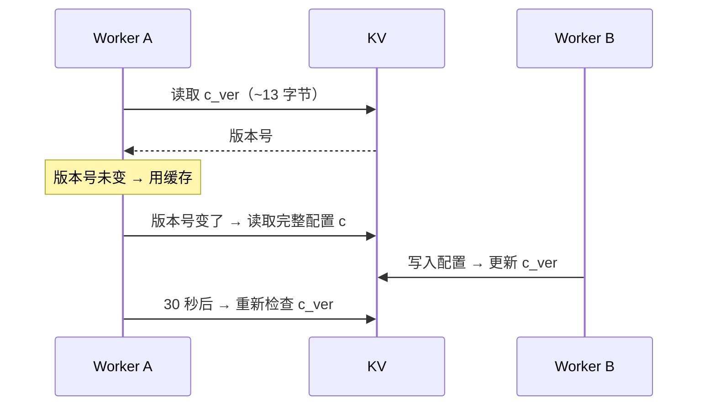
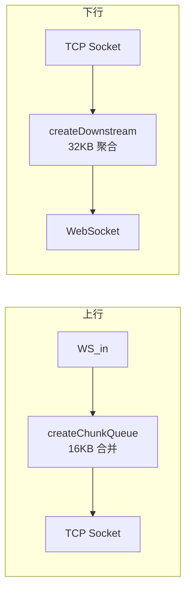

# CFnew — Cloudflare Worker VLESS 代理服务

## 项目概述

CFnew 是一个基于 Cloudflare Workers 的 VLESS WebSocket 代理服务，支持 Clash / Sing-box / V2Ray 等主流客户端协议格式的订阅生成。

### 核心功能

- **VLESS + WebSocket 代理** — 基于 VLESS v1/v2 协议，通过 WebSocket 隧道转发 TCP 流量
- **连接竞速** — 同时发起 2 路 TCP 连接，取先到者，显著降低延迟
- **三级降级链** — 直连 → SOCKS5 → Fallback ProxyIP，保障可用性
- **GrainTCP 传输优化** — 上行 16KB 合并批量发送，下行 32KB 聚合大幅减少小包数量
- **管理面板** — 在线配置、订阅链接复制、节点管理
- **多客户端支持** — 直接生成 Clash / Clash.Meta YAML、Sing-box JSON、V2Ray Base64 订阅
- **优选 IP** — 支持自定义优选 IP/域名，地区就近匹配
- **KV 持久化** — 配置热保存，30 秒跨隔离区即时生效

### 项目结构

```
cfnew/
├── src/
│   ├── index.js          # 入口 + 路由（221 行）
│   ├── config.js          # 三层配置系统（280 行）
│   ├── proxy.js           # WebSocket 代理核心（876 行）
│   ├── admin.js           # 管理面板 + REST API（384 行）
│   ├── subscribe.js       # 订阅生成器（574 行）
│   └── utils.js           # 工具函数（286 行）
├── .github/workflows/
│   ├── obfuscate.yml      # 自动混淆 CI
│   └── test.yml           # 自动发布 CI
├── wrangler.toml          # Workers 部署配置
├── package.json           # 构建/部署脚本
├── obfuscate-worker.js    # 混淆脚本
├── _worker.js             # 混淆产物（.gitignore，由 CI 提交）
└── DOCUMENTATION.md
```

总计约 **2621 行** 模块化源码。

---

## 快速开始

```bash
# 1. 安装依赖
npm install

# 2. 构建 + 混淆 + 部署（一步到位）
npm run deploy

# 3. 访问 https://你的-worker名.workers.dev
# 看到管理面板即部署成功
```

> ⚠️ **必须设置自己的 UUID 再使用**，默认 UUID 是公开的。见下方「配置详解」。

---

## 部署方式

所有部署路径均**先混淆、后部署**，生产环境和开发测试使用同一套混淆流水线。

### 方式一：Workers（推荐）

```bash
# 设置 UUID（仅首次）
npx wrangler deploy --var uuid=你的-uuid

# 后续：构建 + 混淆 + 部署
npm run deploy

# 这个命令等价于：
#   1. npm run build:obfuscate  →  esbuild 打包 → javascript-obfuscator 混淆
#   2. npx wrangler deploy       →  部署 _worker.js
```

### 方式二：Pages

```bash
# 1. 构建 + 混淆
npm run build:obfuscate

# 2. 上传 _worker.js
#    Cloudflare 面板 → Workers & Pages → Pages → 上传
#    选择 _worker.js
```

**Pages 环境变量** 不支持 `wrangler.toml`，必须在面板设置：
```
Pages 项目 → 设置 → 环境变量 → 添加
uuid = 你的-uuid
```

### 本地开发

```bash
npm run dev
# 每次自动先 build:obfuscate 再启动 wrangler dev
# 本地 http://localhost:8787
```

### 部署方式对比

| 维度 | Workers ⭐ | Pages |
|------|-----------|-------|
| 命令 | `npm run deploy` | `build:obfuscate` → 上传 |
| 源码保护 | ✅ 混淆后部署 | ✅ 混淆后部署 |
| 免费额度 | 10 万请求/天 | 不限请求数 |
| 环境变量 | wrangler.toml + 面板 | 仅面板 |
| KV 绑定 | wrangler.toml 配置 | Pages → 设置 → 函数 → KV 命名空间绑定 |
| CI 自动部署 | GitHub Actions 构建+混淆+提交+部署 | GitHub Actions 打包 Release |
| 推荐 | ⭐ 首选 | 备选（配额不够时） |

---

## 配置详解

### 配置优先级

```
KV 存储 > 环境变量 > 硬编码默认值
```

三个来源按优先级合并，KV 中的值会覆盖同名环境变量。

### 环境变量

所有变量在 `wrangler.toml` 的注释中定义，支持 **大小写** 和 **下划线** 两种风格：

| 变量 | 别名 | 默认值 | 说明 |
|------|------|--------|------|
| `uuid` | `UUID` | `351c9981-04b6...` | **核心认证 UUID，部署后必须修改！** |
| `customPath` | `d` / `D` | 空 | 自定义访问路径（替代 UUID 路径） |
| `proxyIP` | `p` / `P` | 空 | 自定义回退 ProxyIP（格式: `host:port`） |
| `socks5` | `s` / `S` | 空 | SOCKS5 代理（格式: `user:pass@host:port`） |
| `customDNS` | — | `https://223.5.5.5/dns-query` | 自定义 DNS over HTTPS |
| `alpn` | `ALPN` | 空 | TLS ALPN（`h3,h2,http/1.1` 等） |
| `ech` | `ECH` | `no` | ECH（Encrypted Client Hello）开关 |
| `ena` | `ENA` | `no` | 在订阅中启用原生域名节点 |
| `epd` | `EPD` | `yes` | 订阅包含优选域名 |
| `epi` | `EPI` | `yes` | 订阅包含优选 IP |
| `egi` | `EGI` | `yes` | 订阅包含自定义优选 |
| `rm` | `RM` | `yes` | 地区匹配（就近分配 Fallback） |
| `qj` | `QJ` | 空 | 降级模式（直连失败后自动降级） |
| `dkby` | `DKBY` | `no` | 仅 TLS 节点 |
| `yxby` | `YXBY` | 空 | 关闭优选 IP |
| `yx` | `YX` | 空 | 自定义优选 IP/域名列表 |
| `yxURL` | `YXURL` | 空 | 优选 IP 来源 URL |
| `ipv4` | `IPV4` | `yes` | 使用 IPv4 |
| `ipv6` | `IPV6` | `yes` | 使用 IPv6 |
| `homepage` | `HOMEPAGE` | 空 | 首页伪装 URL |
| `ae` | `AE` | 空 | 允许 API 管理 |

#### 设置方式示例

```bash
# 命令行方式
npx wrangler deploy \
  --var uuid=aaaaaaaa-bbbb-cccc-dddd-eeeeeeeeeeee \
  --var proxyIP=1.2.3.4:443 \
  --var socks5=user:pass@my-proxy:1080

# 面板方式：Cloudflare 控制台 → 你的 Worker → 设置 → 变量 → 添加
```

### KV 持久化配置

KV 用于在线保存配置（通过管理面板修改，不需重新部署）。

#### 1. 创建 KV 命名空间

Cloudflare Dashboard → Workers & Pages → KV → 创建命名空间：
- 名称：任意，例如 `CFNEW_CONFIG`
- 绑定名称：**必须为 `C`**

#### 2. 配置 wrangler.toml

取消注释 `wrangler.toml` 末尾的 KV 绑定，填入命名空间 ID：

```toml
[[kv_namespaces]]
binding = "C"
id = "你的-kv-namespace-id"
```

#### 3. 重新部署

```bash
npx wrangler deploy
```

之后管理面板的「保存配置」按钮就会生效，修改即时保存到 KV。

#### KV 缓存机制



- KV 读取缓存 **30 秒**
- 写入配置时自动更新 `c_ver` 版本键
- 其他 Worker 实例在下次请求时自动发现新版本

### 默认配置

默认值定义在 `src/config.js` 的 `DEFAULT_CONFIG` 对象中：

```javascript
{
  uuid:       '351c9981-04b6-4103-aa4b-864aa9c91469',
  customPath: '',
  enableVLESS: 'yes',
  proxyIP:    '',
  socks5:     '',
  customDNS:  'https://223.5.5.5/dns-query',
  yx:         '',
  epd: 'yes', epi: 'yes', egi: 'yes',
  ech: 'no', ena: 'no',
  ipv4: 'yes', ipv6: 'yes',
}
```

---

## 管理面板

部署后访问 `https://你的-worker名.workers.dev` 即可看到管理面板。

### 功能

1. **客户端订阅** — 一键复制 Clash / Sing-box / V2Ray 订阅链接
2. **系统状态** — 显示 Worker 地区、KV 状态、协议、域名
3. **配置管理** — 在线编辑并保存配置（需 KV）
4. **高级控制** — 降级模式、仅 TLS、ECH、原生地址等开关
5. **订阅链接** — 各客户端的完整订阅 URL

### 订阅链接格式

```
# Clash（推荐 Windows / macOS）
https://你的域名/你的-UUID/sub?target=clash

# Sing-box（推荐 Android / iOS）
https://你的域名/你的-UUID/sub?target=singbox

# V2Ray / Base64（通用）
https://你的域名/你的-UUID/sub?target=v2ray
# 或简写
https://你的域名/你的-UUID/sub
```

### 自定义路径

如果设置了 `customPath`（环境变量 `d`），路径中的 UUID 可替换为自定义路径：

```
# customPath = "mysecret"
https://你的域名/mysecret/sub?target=clash
```

---

## API 参考

### 配置管理 API

```
GET  /{path}/api/config     — 获取当前配置快照
POST /{path}/api/config     — 保存配置（需要 KV）
```

**POST 请求体（JSON）：**
```json
{
  "proxyIP": "1.2.3.4:443",
  "customDNS": "https://dns.google/dns-query",
  "yx": "1.1.1.1#节点A,2.2.2.2#节点B",
  "qj": "yes",
  "dkby": "yes"
}
```

只传需要修改的字段即可，其他字段保持不变。

### 优选 IP 管理 API

```
GET    /{path}/api/preferred-ips   — 获取当前优选 IP 列表
POST   /{path}/api/preferred-ips   — 添加优选 IP
DELETE /{path}/api/preferred-ips   — 删除优选 IP
```

**POST 请求体：**
```json
// 添加单个
{"ip": "1.2.3.4#香港节点"}

// 添加多个
{"all": true, "ips": ["1.2.3.4#HK", "5.6.7.8#SG"]}
```

**DELETE 请求体：**
```json
// 清空全部
{"all": true}

// 删除特定
{"ip": "1.2.3.4"}
```

### 地区检测 API

```
GET /{path}/region
```

返回 Worker 所在地区及检测方式。

### 订阅生成 API

```
GET /{path}/sub?target={format}
```

| 参数 | 格式 | 适用客户端 |
|------|------|-----------|
| `target=clash` | YAML | Clash / Clash.Meta / Clash Verge / Flclash |
| `target=singbox` | JSON | Sing-box / SFI / NekoBox |
| `target=v2ray` 或默认 | Base64 | V2Ray / V2RayNG / Shadowrocket / Nekoray |

### WebSocket 代理端点

```
WS /{path}
```

使用 VLESS v1/v2 协议，UUID 认证。客户端通过 WebSocket 隧道连接到目标服务器。

**连接流程：**

```
客户端 WS  →  UUID 认证（VLESS 头部）
           →  解析目标地址（IPv4/域名/IPv6）
           →  并发 TCP 竞速（2 路，3.5 秒首字节超时）
           →  成功 → 数据转发（上传合并 + 下载聚合）
           →  失败 → SOCKS5 降级 → Fallback ProxyIP
```

---

## 客户端设置

### Clash / Clash.Meta

**推荐客户端：**
- Windows / macOS: [Clash Verge](https://github.com/zzzgydi/clash-verge/releases)
- 全平台: [Flclash](https://github.com/chen08209/FlClash/releases)

**配置方式：**
1. 打开客户端 → 订阅 → 添加
2. URL 填入 `https://你的域名/你的-UUID/sub?target=clash`
3. 自动更新间隔设为 24 小时
4. 更新订阅 → 选择一个节点 → 开启系统代理

**生成的 YAML 包含：**
- Loyalsoldier 完整规则集（rule-providers）
- 分类策略组（媒体/谷歌/奈飞/OpenAI/电报/直连）
- 优化 DNS 配置（fake-ip 模式 + DoH 回退）
- 域名嗅探（sniffer）自动识别 TLS 目标

### Sing-box

**推荐客户端：**
- Android: [SFI](https://github.com/SagerNet/sing-box/releases)
- 通用: NekoBox / sing-box 核心

**配置方式：**
1. 导入 `https://你的域名/你的-UUID/sub?target=singbox`
2. 选择 `select` 策略组
3. 选择一个节点

**生成的 JSON 包含：**
- Tun 虚拟网卡模式 + Mixed 端口模式
- MetaCubeX SRS 远程规则集
- 分类出站组
- DNS 防泄漏配置
- Clash API 兼容代理

### V2Ray（通用 Base64 格式）

**推荐客户端：**
- Windows: V2RayN / Nekoray
- Android: V2RayNG
- iOS: Shadowrocket / FoxRay

**配置方式：**
- 订阅 URL 直接填入即可

---

## 架构说明

### 配置系统（config.js）

三层优先级：**KV > 环境变量 > 默认值**

```
读取流程：
  1. 初始化 KV 绑定（env.C）
  2. 读取 KV 中的配置 → 合并到 currentConfig
  3. 读取环境变量 → 基础值
  4. 填充 DEFAULT_CONFIG → 兜底

写入流程：
  1. 写入 KV（c 键）
  2. 更新 c_ver 版本键（跨 isolate 通知）
  3. 下次请求自动加载新配置
```

### 代理核心（proxy.js）

```
请求流程：
  HTTP Upgrade: websocket
    → new WebSocketPair()
    → createWSStream() — WS → ReadableStream
    → parseVLESSHeader() — 解析协议头部
      ├─ 版本检查（v1/v2）
      ├─ UUID 认证（16 字节对比）
      ├─ 地址类型解析（IPv4/Domain/IPv6）
      └─ 端口提取
    → handleConnect() — 连接 + 降级
      ├─ connectRace() — 2 路并发竞速
      ├─ createChunkQueue() — 上传合并
      ├─ createDownstream() — 下载聚合
      └─ pipeTCPtoWS() — TCP → WS 转发
        └─ 首字节超时（3.5s）→ 触发降级
```

### 传输优化



- **上行合并：** 小包缓冲到 16KB 再发送，减少 TCP 小包（Nagle 算法效果）
- **下行聚合：** 32KB 缓冲 + 延迟发送 + 尾部直通，平衡延迟与吞吐
- **大包直发：** 超过 32KB 的数据不缓冲直接发送

### 降级链

```
直连成功 ───────────────────────────→ ✅ 数据转发
      │ 失败
      ▼
SOCKS5 代理（若配置） ──────────────→ ✅ 数据转发
      │ 失败
      ▼
Fallback ProxyIP（就近选择） ────────→ ✅ 数据转发
      │ 失败
      ▼
    ❌ 连接关闭
```

- 首字节超时 **3.5 秒** 触发降级
- Fallback 按 Worker 地区就近分配（US/SG/JP/KR/DE/SE/NL/FI/GB）
- 降级可通过 `qj` 变量启用/禁用

### 路由对照

| 路径 | 方法 | 处理模块 | 功能 |
|------|------|---------|------|
| `/` | GET | admin.js | 管理面板 |
| `/{path}/sub` | GET | subscribe.js | 订阅生成 |
| `/{path}/api/config` | GET/POST | admin.js | 配置管理 |
| `/{path}/api/preferred-ips` | GET/POST/DELETE | admin.js | 优选 IP |
| `/{path}/region` | GET | index.js | 地区检测 |
| `/{path}` | WS | proxy.js | VLESS 代理 |
| `/{path}` | POST | — | 预留 xhttp（当前 404） |
| `/*` | 任意 | — | 404 |

---

## 构建与开发

### 构建命令

```bash
# ⭐ 全流程：构建 + 混淆 + 部署 Workers
npm run deploy

# 构建 + 混淆（输出 _worker.js）
npm run build:obfuscate

# 本地开发（自动构建混淆后启动）
npm run dev

# 仅 esbuild 打包（不混淆，调试用）
npm run build

# 仅 esbuild 打包 + 不压缩（调试用）
npm run build:dev

### esbuild 打包细节

```bash
esbuild src/index.js \
  --bundle          # 打包所有 import
  --outfile=_worker.js
  --format=esm      # ESM 模块格式
  --minify          # 压缩（生产）
```

Cloudflare Workers 使用 `cloudflare:sockets` 作为内置模块，esbuild 默认无法解析，但 wrangler 在部署时自动处理。如果用 `npm run build` 则需要注意这个差异。

### 依赖

- **生产依赖：** 无（纯 Workers 运行时）
- **开发依赖：** `wrangler`（部署工具）、`esbuild`（打包）、`javascript-obfuscator`（混淆）

---

## 代码混淆

部署到生产环境的代码经过混淆处理，保护源码逻辑不被直接读取。

### 构建混淆命令

```bash
# 完整构建流程：esbuild 打包 → javascript-obfuscator 混淆
npm run build:obfuscate

# 输出: _worker.js（混淆后）
```

### 构建流水线

```
src/index.js
  ↓ (import 解析)
esbuild --bundle --format=esm --minify
  ↓ (单文件)
_worker.js (43 KB 压缩后)
  ↓
javascript-obfuscator
  ├─ stringArray + base64 编码
  ├─ mangled-shuffled 标识符
  ├─ unicodeEscapeSequence 转义
  ├─ splitStrings 分割字符串
  └─ compact 压缩
  ↓
_worker.js (170+ KB 混淆后) → 部署
```

### 混淆配置

完整选项定义在 `obfuscate-worker.js` 中，核心策略：

| 选项 | 值 | 效果 |
|------|-----|------|
| `stringArray` | `true` | 字符串提取到数组 |
| `stringArrayEncoding` | `['base64']` | 字符串 base64 编码 |
| `stringArrayThreshold` | `1.0` | 100% 字符串被编码 |
| `identifierNamesGenerator` | `mangled-shuffled` | 变量名随机混淆 |
| `splitStrings` | `true` | 字符串分割成小块 |
| `unicodeEscapeSequence` | `true` | Unicode 转义 |

### GitHub Actions 自动混淆

推送到 `refactor/simplify-v2` 分支且修改 `src/` 目录下的文件时，自动触发混淆流水线：

1. `npm ci` 安装依赖
2. `npm run build:obfuscate` 构建并混淆
3. 自动提交 `_worker.js`（commit message: `部署用这个`）
4. 推送到仓库

### Pages 部署包发布

打 `v*` 标签时自动创建 GitHub Release：

```bash
git tag v3.0.1
git push origin v3.0.1
```

工作流自动：
1. 构建 + 混淆
2. 打包 `_worker.js` + `wrangler.toml` → `Pages.zip`
3. 创建 GitHub Release 并上传 `Pages.zip`

下载后解压，在 Cloudflare Pages 面板上传即可。

### 混淆文件说明

| 文件 | 作用 |
|------|------|
| `src/*.js` | **源代码**（明文），日常开发修改这里 |
| `_worker.js` | **混淆产物**，由 GitHub Actions 自动生成并提交 |
| `obfuscate-worker.js` | **混淆脚本**，本地运行 `npm run build:obfuscate` 用 |

> ⚠️ **不要手动修改 `_worker.js`**，它是自动化构建产物。所有改动应在 `src/` 目录中完成。

---

## 常见问题

### Q: 部署后访问返回 404？

**原因：** 路径必须匹配 UUID 或自定义路径。

**解决：** 访问 `/`（首页）查看管理面板。确认环境变量 `uuid` 是否设置正确。

### Q: 如何修改默认 UUID？

```bash
npx wrangler deploy --var uuid=你的新-uuid
```

或 Cloudflare 面板 → Worker → 设置 → 变量 → 添加 `uuid`。

### Q: 管理面板的「保存配置」按钮无效？

需要配置 KV 绑定。见上方「KV 持久化配置」章节。

### Q: 连接失败 / 延迟高？

1. 尝试启用降级模式：面板 → 高级控制 → 降级模式
2. 检查 `proxyIP` 是否可用
3. 尝试添加优选 IP：面板 → 配置管理 → 优选IP
4. 不同地区的 Worker 连接不同目标有差异，试试 `wk` 手动指定地区

### Q: 如何在 URL 上临时指定参数？

```
wss://你的域名/你的-UUID?p=alternative-fallback:443&rm=no
```

- `p` — 临时覆盖 ProxyIP
- `wk` — 临时覆盖 Worker 地区
- `rm` — 临时覆盖地区匹配（`no` 关闭）
- `s` — 临时使用 SOCKS5

### Q: 每天 10 万请求不够用？

- 换 Pages 部署（无请求数限制）
- 减少订阅更新频率
- 添加 KV 减少配置读取消耗

### Q: 出现 "invalid user" 错误？

UUID 不匹配。检查客户端配置的 UUID 与服务端设置是否一致。

### Q: 出现 "invalid addressType: 0" / "invalid data"？

- 客户端协议不是 VLESS？确认客户端选择的是 VLESS 协议
- WebSocket 路径是否正确？默认 `/` 路径携带 `/?ed=2048` 参数

---

## 分支

| 分支 | 说明 |
|------|------|
| `main` | 原始单文件版（8784 行） |
| `refactor/simplify-v2` | 路线 B 简化模块版（2621 行，含管理面板） |

---

## 更新日志

### v3.0.0 (refactor/simplify-v2)

- 完全模块化重构：6 个模块共 2621 行
- 新增管理面板（管理面板、REST API、一键订阅）
- 新增 Clash / Sing-box 完整配置订阅生成
- 新增三层配置系统（KV > 环境变量 > 默认值）
- 新增连接竞速 + 三级降级链
- 新增 GrainTCP 传输优化（上传合并 + 下载聚合）
- 新增 esbuild 构建流水线
- 完整中文注释
